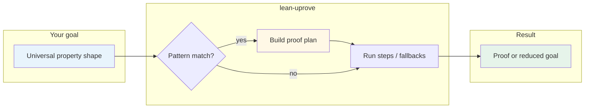

<div align="center">

# lean-uprove

**Universal-property proofs in Lean 4, with automation you can trace.**

[](https://github.com/fraware/lean-uprove/actions/workflows/ci.yml)
[](https://leanprover.github.io/)
[](https://opensource.org/licenses/MIT)
[](https://github.com/leanprover-community/mathlib4)

<br/>

[Quick start](#quick-start) · [Documentation](#documentation) · [Examples](#examples) · [API](#api-reference) · [Contributing](#contributing)

<br/>

</div>

> A tactic for category-theoretic goals: limits, colimits, (co)products, (co)equalizers, pullbacks, pushouts, and related patterns. When your goal matches a registered lemma, **`by uprove`** can close it; **`by uprove?`** shows the plan.

---

## Why lean-uprove

| | |
|:---|:---|
| **Pattern-driven** | Matches Mathlib-style universal property statements and applies registered lemmas instead of ad-hoc search. |
| **Bounded & predictable** | Step limits, timeouts, and explicit fallbacks keep automation from running away. |
| **Inspectable** | Explainer mode prints a human-readable proof plan so you can audit what happened. |
| **Same checks as CI** | Locally: `lake build`, `lake build UproveExamples`, `lake test`. |

Design targets (not guarantees on every goal): about **150ms** P50, **800ms** P95, **256MB** peak memory in benchmark-style runs—see [Performance](#performance).

---

## How it works



---

## Quick start

### From this repository

```bash
git clone https://github.com/fraware/lean-uprove.git
cd lean-uprove
lake build && lake build UproveExamples && lake test
```

Optional: `make dev && make run` for a broader smoke path (see [Development](#development)).

### In your own project

**1.** Align your `lean-toolchain` with this package when you can.

**2.** Add the dependency (Lake project file):

```lean
require «lean-uprove» from git
  "https://github.com/fraware/lean-uprove.git" @ "main"   -- or a tag / commit
```

**3.** Import registration and the library (`import Uprove` alone does not load default registration):

```lean
import UproveRegisterInit
import Uprove
```

**4.** Use the tactic when the goal matches a registered pattern:

```lean
-- by uprove
-- by uprove?
-- by uprove [Uprove.fastConfig]
-- by uprove [{ maxSteps := 32, timeout := 1000 }]
```

**Mathlib 4.12** uses `limit.cone` and `colimit.cocone`. Many standard facts are `noncomputable def` with `limit.isLimit _` rather than `theorem … := by uprove`. Copy shapes from [`examples/BasicExamples.lean`](examples/BasicExamples.lean); build them with `lake build UproveExamples`.

**Docker** (optional):

```bash
docker run --rm ghcr.io/fraware/lean-uprove:latest --help
```

Lake remains the reliable way to build and test this package.

---

## Documentation

| | |
|:--|:--|
| [**Docs index**](docs/README.md) | All guides in one place |
| [**Quickstart**](docs/Quickstart.md) | Toolchain, dependency, imports, naming |
| [**Cookbook**](docs/Cookbook.md) | Patterns and configuration |
| [**Troubleshooting**](docs/Troubleshooting.md) | Common errors and fixes |
| [**CI/CD**](docs/CI-CD.md) | What runs in automation |
| [**Architecture**](docs/architecture.md) | Layout and data flow |
| [**Contributing**](CONTRIBUTING.md) | How to contribute |

API reference: this README plus the Lean sources under `Uprove/` (there is no separate generated doc site yet).

---

## Examples

```lean
import UproveRegisterInit
import Uprove
import Mathlib.CategoryTheory.Limits.HasLimits
-- … your category and instances …

-- Typical Mathlib 4.12 style (see BasicExamples.lean for full lemmas):
-- noncomputable def product_limit … : IsLimit (limit.cone (pair X Y)) := limit.isLimit _
```

Combine `by uprove?`, presets like `Uprove.thoroughConfig`, and manual `constructor` when automation only covers part of the goal.

---

## API reference

Default registration lives in **`UproveRegisterInit`** ([`UproveRegisterInit.lean`](UproveRegisterInit.lean)). Import it once. If you only import `Uprove.Tactics`, you still need **`UproveRegisterInit`** unless you register everything with `@[uproveLemma]` / `@[uprove.iso]`.

### Tactics

| Tactic | Role |
|:--|:--|
| `by uprove` | Close or simplify goals that match a registered pattern |
| `by uprove?` | Same, plus a printed proof plan |
| `by uprove [cfg]` | One configuration value, e.g. `Uprove.fastConfig` or `{ maxSteps := 32, timeout := 1000 }` |

### Attributes

| Attribute | Role |
|:--|:--|
| `@[uproveLemma]` | Register a lemma for matching |
| `@[uprove.iso]` | Register an isomorphism hook |

### Common options

| Field | Typical default | Meaning |
|:--|:--|:--|
| `maxSteps` | `64` | Step cap |
| `timeout` | `2000` (ms) | Time budget |
| `simpSet` | — | Named simp set |
| `trace` | `false` | Extra logging |
| `strict` | `false` | Fail instead of falling back |
| `fallback` | `["simp", "aesop"]` | Fallback tactic names |

Full structure: `Uprove/Configuration.lean`.

---

## Performance

**Targets** from benchmark-style runs in this repository; cold cache, large projects, or unmatched goals may differ.

| Metric | Target | Notes |
|:--|:--|:--|
| P50 latency | ≤ 150 ms | Per successful invocation |
| P95 latency | ≤ 800 ms | Tail behavior |
| Peak memory | ≤ 256 MB | Benchmark configuration |
| Proof time | ≥ 40% faster | Versus manual scripts in measured scenarios |

```text
Example summary (illustrative)
├── Product limits     ~142 ms (P50), ~756 ms (P95)
├── Coproduct colimits ~138 ms (P50), ~723 ms (P95)
├── Equalizers         ~156 ms (P50), ~812 ms (P95)
└── Pullbacks          ~149 ms (P50), ~789 ms (P95)
```

Optional: `lake exe uprove-benchmark` (native linking may fail on some Windows toolchains).

---

## Installation (all options)

<details>
<summary><strong>Docker</strong></summary>

```bash
docker run --rm ghcr.io/fraware/lean-uprove:latest --help
docker pull ghcr.io/fraware/lean-uprove:latest
docker run --rm ghcr.io/fraware/lean-uprove:latest test
```

</details>

<details>
<summary><strong>Install scripts</strong></summary>

Linux / macOS:

```bash
curl -fsSL https://raw.githubusercontent.com/fraware/lean-uprove/main/scripts/install.sh | bash
```

Windows (PowerShell):

```powershell
Invoke-WebRequest -Uri "https://raw.githubusercontent.com/fraware/lean-uprove/main/scripts/install.bat" -OutFile "install.bat"
.\install.bat
```

</details>

<details>
<summary><strong>From source</strong></summary>

```bash
git clone https://github.com/fraware/lean-uprove.git
cd lean-uprove
make dev && make run
```

Verify:

```bash
lake build
lake build UproveExamples
lake test
lake exe test
```

</details>

<details>
<summary><strong>As a dependency</strong></summary>

```lean
require «lean-uprove» from git
  "https://github.com/fraware/lean-uprove.git" @ "main"
```

</details>

---

## Development

```bash
lake build
lake build UproveExamples
lake test
lake exe test
# optional:
lake exe uprove-benchmark
```

### Tests (excerpt)

| Suite | Command |
|:--|:--|
| Default | `lake test` |
| Smoke | `lake exe test` |
| Core | `lake exe uprove-test-simple` |
| Production | `lake exe uprove-test-production` |
| Performance | `lake exe uprove-performance-validation` |
| Real-world | `lake exe uprove-test-real` |

`make test` runs additional executables.

---

## Contributing

See [**CONTRIBUTING.md**](CONTRIBUTING.md).

- [ ] `lake build` and `lake build UproveExamples` pass  
- [ ] `lake test` passes when you change the test driver  
- [ ] Update docs when commands or behavior change  

[**Lean community code of conduct**](https://leanprover-community.github.io/contribute/code_of_conduct.html)

---

## License

[MIT](LICENSE)

---

## Community

| | |
|:--|:--|
| **Issues** | [github.com/fraware/lean-uprove/issues](https://github.com/fraware/lean-uprove/issues) |
| **Discussions** | [github.com/fraware/lean-uprove/discussions](https://github.com/fraware/lean-uprove/discussions) |

---

## Releases

Version notes and assets: [**GitHub Releases**](https://github.com/fraware/lean-uprove/releases)

---

## Acknowledgments

Built with [**Mathlib4**](https://github.com/leanprover-community/mathlib4) and the Lean 4 ecosystem. Thanks to everyone who reports issues, suggests patterns, and contributes proofs.

<div align="center">

<br/>

[↑ Back to top](#lean-uprove)

</div>
