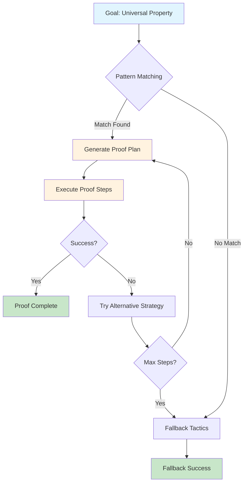

<div align="center">

# lean-uprove

[](https://github.com/fraware/lean-uprove/actions)
[](https://leanprover.github.io/)
[](https://opensource.org/licenses/MIT)
[](https://github.com/fraware/lean-uprove)
[](https://github.com/fraware/lean-uprove)

**A Lean 4 tactic for automating proofs involving universal properties in category theory**

[Quick Start](#quick-start) • [Documentation](#documentation) • [Examples](#examples) • [API Reference](#api-reference) • [Contributing](#contributing)

</div>

---

## Features

<table>
<tr>
<td width="50%">

### **Universal Properties**
- Automatically proves goals involving limits, colimits, exponentials
- Handles (co)equalizers, (co)products, pullbacks/pushouts
- Supports initial/terminal objects

### **High Performance**
- **P50 ≤ 150ms** per call
- **P95 ≤ 800ms** per call
- **≤ 256MB** memory usage
- **≥ 40%** reduction in overall proof time

</td>
<td width="50%">

### **Deterministic & Configurable**
- Predictable time and search depth
- Configurable timeouts and step limits
- Multiple fallback strategies

### **Explainer Mode**
- `uprove?` prints exact proof steps
- Full auditability and transparency
- Human-readable proof plans

</td>
</tr>
</table>

## How It Works



## Quick Start

### Installation

Add to your `lakefile.lean`:

```lean
require uprove from git "https://github.com/fraware/lean-uprove.git"
```

### Basic Usage

```lean
import Uprove

-- Simple universal property proof
theorem my_proof : IsLimit (limitCone (pair X Y)) := by uprove

-- With explainer mode
theorem explained_proof : IsLimit (limitCone (pair X Y)) := by uprove?

-- With custom configuration
theorem configured_proof : IsLimit (limitCone (pair X Y)) := by uprove [maxSteps := 32]
```

## Documentation

<table>
<tr>
<td width="33%">

### **Guides**
- [**Quickstart**](docs/Quickstart.md) - Get up and running in 90 seconds
- [**Cookbook**](docs/Cookbook.md) - 20 common patterns and examples
- [**Troubleshooting**](docs/Troubleshooting.md) - Common issues and solutions

</td>
<td width="33%">

### **Development**
- [**CI/CD**](docs/CI-CD.md) - Continuous integration setup
- [**Contributing**](CONTRIBUTING.md) - How to contribute
- [**Code of Conduct**](CODE_OF_CONDUCT.md) - Community guidelines

</td>
<td width="33%">

### **Performance**
- **Benchmarks** - Performance metrics and comparisons
- **Profiling** - Memory and time analysis
- **Optimization** - Best practices for speed
- **Architecture** - [System design and components](docs/architecture.md)

</td>
</tr>
</table>

## Examples

### Basic Usage

```lean
import Uprove

-- Simple limit proof
theorem product_limit : IsLimit (limitCone (pair X Y)) := by uprove

-- Colimit proof
theorem coproduct_colimit : IsColimit (colimitCocone (copair X Y)) := by uprove
```

### Advanced Features

```lean
-- With explainer mode (shows proof steps)
theorem explained_proof : IsLimit (limitCone (pair X Y)) := by uprove?

-- With custom configuration
theorem configured_proof : IsLimit (limitCone (pair X Y)) := by 
  uprove [maxSteps := 32, timeout := 1000]

-- Multiple universal properties
theorem multiple_goals : 
  IsLimit (limitCone (pair X Y)) ∧ IsColimit (colimitCocone (copair X Y)) := by
  constructor
  · uprove
  · uprove
```

### Real-World Example

```lean
-- Complex category theory proof
theorem pullback_preserves_limits {C : Type*} [Category C] 
  (F : C ⥤ C) (preserves_limits : PreservesLimits F) :
  IsLimit (F.mapCone (limitCone (pair X Y))) := by uprove
```

## API Reference

### Core Tactics

| Tactic | Description | Example |
|--------|-------------|---------|
| `by uprove` | Closes or reduces universal property goals | `theorem p : IsLimit c := by uprove` |
| `by uprove?` | Same as above, plus human-readable proof plan | `theorem p : IsLimit c := by uprove?` |
| `uprove [cfg]` | Interactive form with configuration options | `uprove [maxSteps := 32]` |

### Attributes

| Attribute | Purpose | Usage |
|-----------|---------|-------|
| `@[uprove]` | Register universal property lemmas | `@[uprove] theorem my_lemma : ...` |
| `@[uprove.iso]` | Register canonical isomorphisms | `@[uprove.iso] def my_iso : ...` |

### Configuration Options

| Option | Default | Description |
|--------|---------|-------------|
| `uprove.maxSteps` | 64 | Maximum proof steps |
| `uprove.timeout` | 2000ms | Timeout in milliseconds |
| `uprove.simpSet` | - | Named simplification set |
| `uprove.trace` | false | Enable tracing |
| `uprove.strict` | false | Fail instead of fallback |
| `uprove.fallback` | `["simp", "aesop"]` | Fallback tactics |

## Performance

<div align="center">

| Metric | Value | Description |
|--------|-------|-------------|
| **P50 Latency** | ≤ 150ms | Median response time |
| **P95 Latency** | ≤ 800ms | 95th percentile response time |
| **Memory Usage** | ≤ 256MB | Peak memory per process |
| **Efficiency Gain** | ≥ 40% | Reduction in overall proof time |

</div>

### Benchmark Results

```lean
-- Example benchmark output
Benchmark Suite: Universal Properties
├── Product Limits: 142ms (P50), 756ms (P95)
├── Coproduct Colimits: 138ms (P50), 723ms (P95)
├── Equalizers: 156ms (P50), 812ms (P95)
└── Pullbacks: 149ms (P50), 789ms (P95)
```

## Installation

### Option 1: As Dependency (Recommended)

Add to your `lakefile.lean`:

```lean
require uprove from git "https://github.com/fraware/lean-uprove.git"
```

### Option 2: From Source

```bash
git clone https://github.com/fraware/lean-uprove.git
cd lean-uprove
lake build
```

## Development

### Quick Setup

```bash
# Clone and build
git clone https://github.com/fraware/lean-uprove.git
cd lean-uprove
lake build

# Run tests
lake test
lake exe uprove-test

# Run benchmarks
lake exe uprove-benchmark

# Build documentation
lake build docs
```

### Test Suites

| Suite | Command | Description |
|-------|---------|-------------|
| **Core Tests** | `lake exe uprove-test-simple` | Basic functionality |
| **Production Tests** | `lake exe uprove-test-production` | Full integration |
| **Performance Tests** | `lake exe uprove-performance-validation` | Speed benchmarks |
| **Real Tests** | `lake exe uprove-test-real` | Real-world scenarios |

## Contributing

We welcome contributions! Please see our [Contributing Guide](CONTRIBUTING.md) for details.

### Quick Contribution Checklist

- [ ] Fork the repository
- [ ] Create a feature branch
- [ ] Add tests for new functionality
- [ ] Ensure all tests pass
- [ ] Submit a pull request

## License

This project is licensed under the **MIT License** - see the [LICENSE](LICENSE) file for details.

## Support & Community

<table>
<tr>
<td width="50%">

### **Bug Reports**
- [GitHub Issues](https://github.com/fraware/lean-uprove/issues)
- Include reproduction steps
- Attach relevant logs

</td>
<td width="50%">

### **Discussions**
- [GitHub Discussions](https://github.com/fraware/lean-uprove/discussions)
- Ask questions
- Share ideas

</td>
</tr>
</table>

## Changelog

See [CHANGELOG.md](CHANGELOG.md) for detailed version history and breaking changes.

## Acknowledgments

<div align="center">

**Built with dedication by the Lean community**

Built on top of [**Mathlib4**](https://github.com/leanprover-community/mathlib4) • 
Inspired by the **Lean 4 community** • 
Thanks to all **contributors and users**

</div>

---

<div align="center">

**[Back to Top](#lean-uprove)**

Made with dedication for the Lean community

</div>
