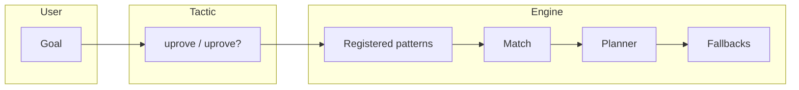

# Architecture

High-level layout of the package. For what automation runs in practice, see [CI-CD.md](CI-CD.md).

## Modules

| Area | Location | Role |
|------|-----------|------|
| Version | `Uprove/Version.lean` | Package version strings |
| Core | `Uprove/Core.lean` | Universal-property types and matching hooks |
| Patterns | `Uprove/Patterns.lean` | Declared patterns |
| Planner | `Uprove/Planner.lean` | Proof plans and safe variants |
| Tactics | `Uprove/Tactics.lean` | `uprove` / `uprove?` |
| Config | `Uprove/Configuration.lean` | Options and presets |
| Telemetry | `Uprove/Telemetry.lean` | Optional logging hooks |
| Registration | `UproveRegisterInit.lean` (repo root) | Builtin attributes and default registration |
| Examples | `examples/BasicExamples.lean` | Mathlib examples checked in CI |

`import Uprove` aggregates the main library. Consumers who need built-in registrations should also **`import UproveRegisterInit`**.

## Data flow (conceptual)

## Matcher and planner

Behavior is routed by structured kinds where possible. The matcher covers a **limited** subset of what Mathlib can express; hard goals may still need manual proofs.

## Performance and timeouts

Timeout helpers exist, but wall-clock limits in the tactic path are not fully strict. Benchmarks and SLA checks live in performance-related modules, `bench/Benchmark.lean`, and optional executables.

## Testing

- `lake build` — main library.
- `lake build UproveExamples` — example theorems.
- `lake test` / `lake exe test` — packaged smoke tests.
- Additional `lake exe …` targets for deeper smoke and performance runs (see README).

## Related docs

- [CI-CD.md](CI-CD.md)
- [Quickstart.md](Quickstart.md)
