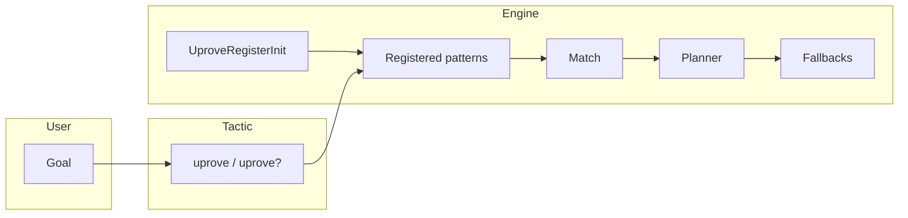

# Architecture

High-level layout after the Lean 4.31 modernization. For CI commands, see [CI-CD.md](CI-CD.md).

## Stable public import (`import Uprove`)

| Module | Role |
|------|------|
| `Uprove/Version.lean` | Package and Mathlib pin strings |
| `Uprove/Core.lean` | Universal-property types, registry, matching |
| `Uprove/Configuration.lean` | `UproveOptions`, presets, validation |
| `Uprove/Patterns.lean` | Tactic pattern metadata (Mathlib constant heads) |
| `Uprove/ProofPatterns.lean` | Extraction-oriented proof shapes (no tactics) |
| `Uprove/Planner.lean` | Three-phase plan: construct / uniqueness / fallback |
| `Uprove/Tactics.lean` | `uprove` / `uprove?` |
| `Uprove/Examples.lean` | Reference limit/colimit goal shapes |

`import Uprove` does **not** load performance, smoke-test, telemetry, or test-support modules.

## Registration

| Module | Role |
|------|------|
| `UproveRegisterInit.lean` | `@[uproveLemma]` / `@[uprove.iso]` and default registration |

Import once in consumer projects. Lives at repo root (not under `Uprove/`) to avoid a Windows initializer crash.

## Extraction examples (CI gate)

| Module | Role |
|------|------|
| `examples/BasicExamples.lean` | Abstract manual + automation proofs for eight constructions |
| `examples/ManualProofs.lean` | Concrete `Type` proofs with explicit `by` scripts |

Built via `lake build UproveExamples`. See [EXTRACTION_LEDGER.md](EXTRACTION_LEDGER.md).

## Optional / internal

| Module | Role |
|------|------|
| `Uprove/Experimental.lean` | Telemetry, timeout, error-handling entry |
| `UproveComparisonExamples.lean` | Optional tactic comparison (not in CI gate) |
| `TestRegisterInit.lean` | Synthetic patterns for Mathlib-free test executables |
| `docs/upstream/` | Mathlib PR drafts (not in Lake build) |

## Data flow



## Verification

Gate 1 (modernization + extraction acceptance):

```bash
scripts/verify-gate1.sh   # Linux/macOS
scripts/verify-gate1.bat  # Windows
```

## Related docs

- [EXTRACTION_LEDGER.md](EXTRACTION_LEDGER.md)
- [upstream/README.md](upstream/README.md)
- [CI-CD.md](CI-CD.md)
- [Quickstart.md](Quickstart.md)
