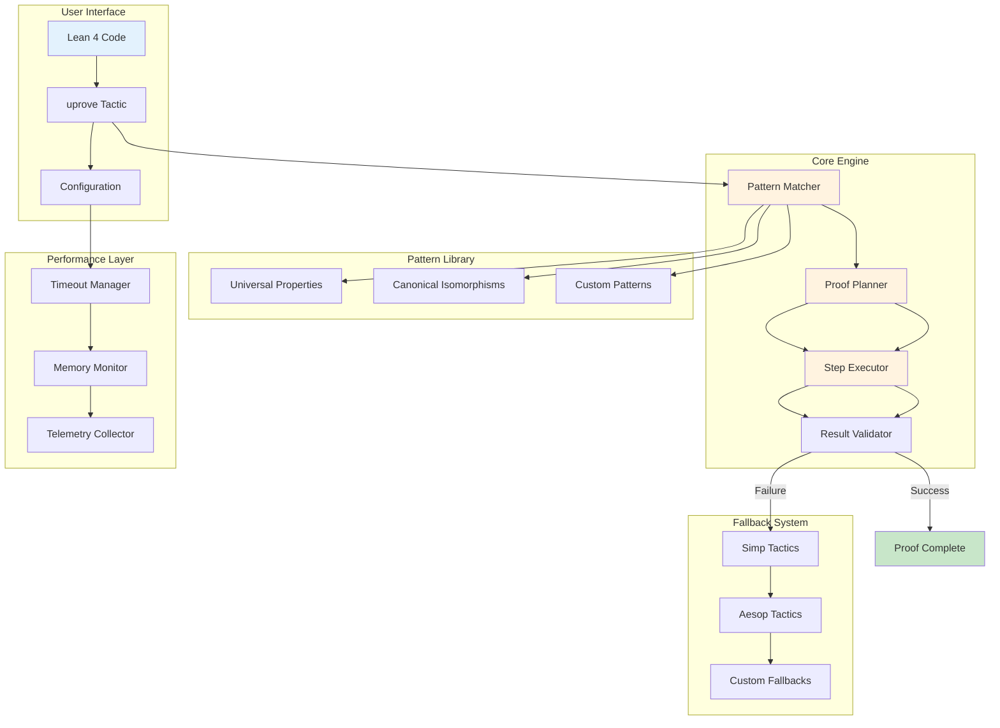
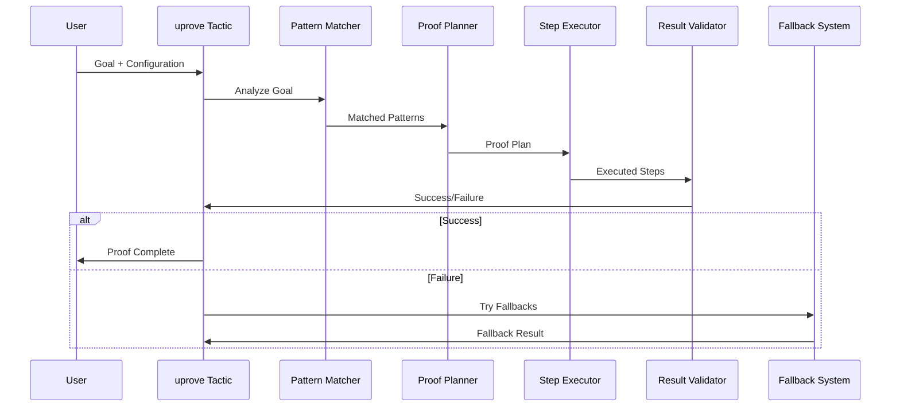

# lean-uprove Architecture

## System Overview

## Component Details

### Pattern Matcher
- Analyzes the goal to identify universal property patterns
- Matches against registered patterns and canonical isomorphisms
- Determines the appropriate proof strategy

### Proof Planner
- Generates a step-by-step proof plan
- Considers multiple strategies and fallbacks
- Optimizes for performance and reliability

### Step Executor
- Executes individual proof steps
- Handles timeouts and resource constraints
- Provides detailed tracing and debugging information

### Result Validator
- Verifies the correctness of generated proofs
- Ensures all constraints are satisfied
- Handles edge cases and error conditions

## Data Flow

## Performance Characteristics

- **Pattern Matching**: O(1) for registered patterns
- **Proof Planning**: O(n) where n is the number of steps
- **Step Execution**: Variable, typically O(log n) for most operations
- **Memory Usage**: Bounded by configuration limits
- **Timeout Handling**: Configurable per operation
